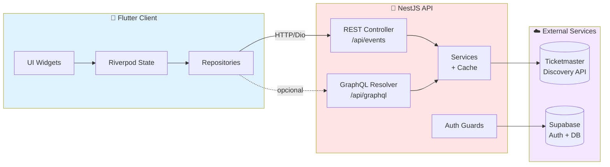
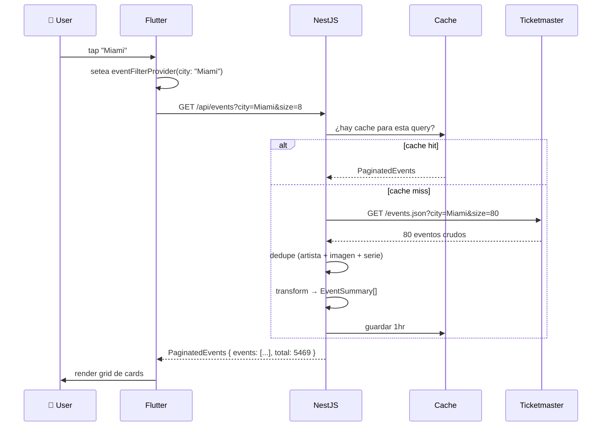

<div align="center">

# 🎫 Tickets

**Plataforma de eventos y ticketing — datos en vivo de Ticketmaster, app móvil + web, backend con GraphQL.**


[](LICENSE)
[](https://github.com/Thirstypooch/tickets/pulls)
[](https://claude.com/claude-code)

[🎤 Charla GitHub Community Day Perú 2026](#-charla-github-community-day-perú-2026) · [⚡ Quick start](#-quick-start) · [🐛 Reportar bug](https://github.com/Thirstypooch/tickets/issues)

</div>

---

## 🎯 ¿Qué es esto?

Una app de eventos en vivo construida como playground para entender cómo construir productos reales **dirigiendo a un AI assistant** (Claude Code). El backend consume la API de Ticketmaster Discovery y la expone vía REST + GraphQL. El cliente Flutter funciona en mobile y web con un solo codebase.

> **Honesto:** este repo nació como una app de alquileres (CRIBS), pivoteó a ticketing, y se construyó con Claude Code como par programador. Cada commit tiene `Co-Authored-By: Claude` en el footer — es parte de la propuesta del proyecto.

---

## 📸 Screenshots

<!-- TODO: agregar screenshots reales una vez que la UI esté final -->

| Home | Detalle de evento | Panel |
|:---:|:---:|:---:|
| _trending events + explorar ciudades_ | _info del evento, lugar, compra_ | _stats + historial_ |
| ⏳ TODO | ⏳ TODO | ⏳ TODO |

---

## ✨ Features

- 🔥 **Trending events** con dedupe inteligente (3 capas: artista, imagen, serie)
- 🌎 **Filtros por ciudad** (NYC, LA, Miami, Chicago, Las Vegas, Nashville)
- 🔍 **Búsqueda** por keyword + ciudad + categoría
- 🎟️ **Detalle completo** del evento con galería, lugar, artistas
- 📱 **Responsive** mobile, tablet, desktop, web — un solo codebase
- 🌗 **Dark mode** soportado
- 🇪🇸 **UI en español** (rioplatense, voseo)
- 🔗 **Compra externa** vía Ticketmaster (deep link al sitio oficial)
- 🛡️ **Auth con Supabase** (auto-confirm en dev, sesiones persistentes)

---

## 🛠️ Stack

### Backend

| Pieza | Tecnología | Por qué |
|---|---|---|
| Framework | **NestJS 11** | Estructura modular, DI, decoradores |
| API | **Apollo GraphQL 5** + REST | GraphQL para queries flexibles, REST para deep-links simples |
| Validación | `class-validator` | DTOs auto-validados |
| HTTP cliente | `@nestjs/axios` + cache-manager | Cache de respuestas de TM (1hr TTL) |
| Auth | **Supabase JS** | Auth + DB en uno, gratis para arrancar |
| Datos | **Ticketmaster Discovery API** | Eventos en vivo, ~5K-21K eventos por ciudad |

### Frontend

| Pieza | Tecnología | Por qué |
|---|---|---|
| Framework | **Flutter** SDK ^3.11 | Un codebase, mobile + web + desktop |
| Estado | **Riverpod** + codegen | Type-safe, tree-shakeable |
| Routing | **GoRouter** | Declarativo, deep-links nativos |
| Modelos | **Freezed** + `json_serializable` | Inmutables, copyWith, equality |
| HTTP | **Dio** | Interceptors, retry, timeout |
| UI | Material 3 + Google Fonts + Lucide icons | Stack moderno y consistente |
| Animaciones | `flutter_animate` | API declarativa |

---

## 🏗️ Arquitectura



### Flujo de un request: "Ver eventos en Miami"



---

## ⚡ Quick start

### Pre-requisitos

- **Node 20+** (`brew install node@20` o `nvm use 20`)
- **Flutter 3.11+** ([instalación oficial](https://docs.flutter.dev/get-started/install))
- **Xcode** (sólo para iOS) o **Android Studio** (para Android)
- **CocoaPods** (sólo iOS): `brew install cocoapods` — si rompe en macOS, ver [troubleshooting](#-troubleshooting)

### 1. Cloná el repo

```bash
git clone https://github.com/Thirstypooch/tickets.git
cd tickets
```

### 2. Backend

```bash
cd backend
npm install
cp .env.example .env  # llenar TM_API_KEY, SUPABASE_*
npm run start:dev     # → http://localhost:3000/api
```

#### Variables de entorno necesarias

```bash
# Ticketmaster (gratis en https://developer-acct.ticketmaster.com/)
TM_API_KEY=your_key_here
TM_BASE_URL=https://app.ticketmaster.com/discovery/v2

# Supabase (gratis en https://supabase.com/)
SUPABASE_URL=https://xxx.supabase.co
SUPABASE_ANON_KEY=eyJxxx...
SUPABASE_SERVICE_ROLE_KEY=eyJxxx...

# App
PORT=3000
NODE_ENV=development
CACHE_TTL=3600
```

### 3. Flutter

```bash
cd ../flutter
flutter pub get
dart run build_runner build --delete-conflicting-outputs   # codegen Freezed/Riverpod
flutter run            # elegí device en el prompt
```

### 4. Probar end-to-end

```bash
# Backend corriendo
curl http://localhost:3000/api/events/featured | jq '.[].name'
# → debería listar 8 eventos variados
```

---

## 📂 Estructura del proyecto

```
tickets/
├── backend/                      # NestJS API
│   ├── src/
│   │   ├── auth/                 # Supabase auth
│   │   ├── events/               # Eventos (controller + resolver)
│   │   ├── ticketmaster/         # Wrapper de TM Discovery API
│   │   │   ├── ticketmaster.service.ts      # ⭐ dedupe en cascada
│   │   │   └── ticketmaster.transformer.ts  # TM payload → DTOs limpios
│   │   ├── bookings/             # Reservas
│   │   ├── favorites/            # Eventos guardados
│   │   ├── reviews/              # Reseñas
│   │   ├── dashboard/            # Stats agregadas
│   │   └── common/               # Guards, decorators
│   └── src/main.ts               # Bootstrap (prefix /api, CORS, validation)
│
├── flutter/                      # App Flutter
│   ├── lib/
│   │   ├── core/
│   │   │   ├── api/              # Dio client
│   │   │   ├── router/           # GoRouter config
│   │   │   ├── theme/            # Material 3 themes
│   │   │   └── utils/            # Formatters
│   │   ├── data/
│   │   │   ├── models/           # Freezed models
│   │   │   ├── repositories/     # API + mock repos
│   │   │   └── datasources/      # Mock data
│   │   └── presentation/
│   │       ├── screens/          # Home, Events, Detail, Dashboard
│   │       ├── widgets/          # Componentes reutilizables
│   │       └── providers/        # Riverpod providers
│   └── pubspec.yaml
│
└── README.md                     # estás acá 👋
```

---

## 🤖 Construido con AI assistance

Este proyecto se construyó con [Claude Code](https://claude.com/claude-code) como par programador. **Cada commit lleva `Co-Authored-By: Claude` en el footer** — no es marketing, es transparencia.

### Lo que la IA hizo bien

- ✅ Andamiaje de módulos NestJS (controllers, services, DTOs)
- ✅ Modelos Freezed + JSON serialization
- ✅ Widgets Flutter responsive con LayoutBuilder
- ✅ Refactor masivo de strings al español (23 archivos en una pasada)

### Lo que la IA no resuelve sola

- ❌ Cache invalidation cuando cambia la lógica de dedupe (siempre lo olvida)
- ❌ Verificar que la API externa devuelva lo esperado — necesitás `curl` con tus propias manos
- ❌ Decisiones de UX (cuándo es OK un SnackBar vs cuándo el botón debe abrir Safari)
- ❌ Diferenciar "una serie de festival" de "matches distintos del mismo torneo"

> **Caso de estudio en vivo:** la home mostraba sólo eventos de Eagles porque la API de TM devolvía 30 fechas del mismo tour. Tomó **3 iteraciones de dedupe** (artista → imagen → name-root con ≥3 palabras) para resolverlo. La historia está en los commits.

---

## 🎤 Charla GitHub Community Day Perú 2026

Este repo es la base de una charla en el **GitHub Community Day Perú 2026** (📅 6 de junio · 📍 UTP Lima Centro).

**Tema:** _Cómo un dev solo se vuelve un equipo de tres_ — workflow real con `git worktree` + Claude + GitHub Actions, demoado en vivo.

Si llegaste acá desde la charla: bienvenido. Cloná, rompé, contribuí.

---

## 🗺️ Roadmap

- [x] Setup base + integración Ticketmaster
- [x] Dark mode
- [x] UI en español
- [x] Dedupe en cascada (artist + image + series)
- [x] Filtros por ciudad
- [ ] **GitHub Actions** (CI: lint + build) — _en progreso_
- [ ] Auth flow completo (signup, recovery)
- [ ] Bookings reales (hoy es mock data)
- [ ] Tests unitarios + integración
- [ ] Deploy: backend en Railway/Fly, app en TestFlight + Play Store
- [ ] PWA con Service Worker
- [ ] Soporte i18n proper (no hardcoded ES)

---

## ⚠️ Limitaciones honestas

- 🟡 **Bookings son mock** — los IDs de TM en `mock_booking_repository.dart` son ficticios. Tap en "Ver Entradas" muestra un SnackBar, no abre el ticket real.
- 🟡 **Sin tests automatizados** todavía (parte del roadmap)
- 🟡 **Naming legacy** — todavía hay referencias a "CRIBS" del proyecto original (en `package.json` y `pubspec.yaml`). Cosmético, no rompe nada.
- 🟡 **Cache TTL 1hr** — si TM cambia algo, podés ver datos viejos hasta que expire.
- 🟡 **Single-region** — sólo eventos USA/CA (limitación de TM Discovery API gratis).

---

## 🐛 Troubleshooting

<details>
<summary><b>CocoaPods roto en macOS (Could not find 'ffi')</b></summary>

Suele pasar después de un brew upgrade Ruby. Fix:

```bash
brew reinstall cocoapods
```

</details>

<details>
<summary><b>iOS Simulator dice "unavailable, runtime profile not found"</b></summary>

Falta descargar el runtime de iOS (no viene con Migration Assistant):

```bash
xcodebuild -downloadPlatform iOS
```

Tarda ~10 min, descarga ~7GB.

</details>

<details>
<summary><b>Flutter: MissingPluginException después de instalar package</b></summary>

Hot-restart no carga plugins nativos nuevos. Necesitás:

```bash
# en la terminal de flutter run:
q                # salir
flutter run      # arrancar limpio (ejecuta pod install)
```

</details>

<details>
<summary><b>Backend devuelve 404 en todos los endpoints</b></summary>

Recordá el prefix global `/api`:
- ❌ `http://localhost:3000/events/featured`
- ✅ `http://localhost:3000/api/events/featured`

</details>

---

## 🤝 Contributing

Issues y PRs bienvenidos. No hay workflow formal todavía:

1. Abrí un issue describiendo lo que querés cambiar
2. Forkeá, rama nueva (`git checkout -b feat/mi-cambio`)
3. Hacé el cambio
4. Abrí PR contra `main`

Si encontrás un bug en producción (eg. el Eagles dominando la home otra vez), abrí issue con:
- Screenshot
- URL exacta que falla
- Output de `curl` al endpoint

---

## 📜 License

[MIT](LICENSE) — usalo, modificalo, vendelo. Si te resulta útil, dejá una estrella ⭐.

---

<div align="center">

**[⬆ Volver arriba](#-tickets)**

Construido con ☕, Flutter, NestJS y un AI pair programmer en Buenos Aires 🇦🇷.

</div>
